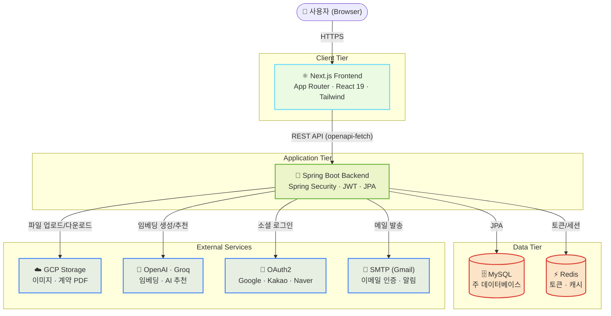
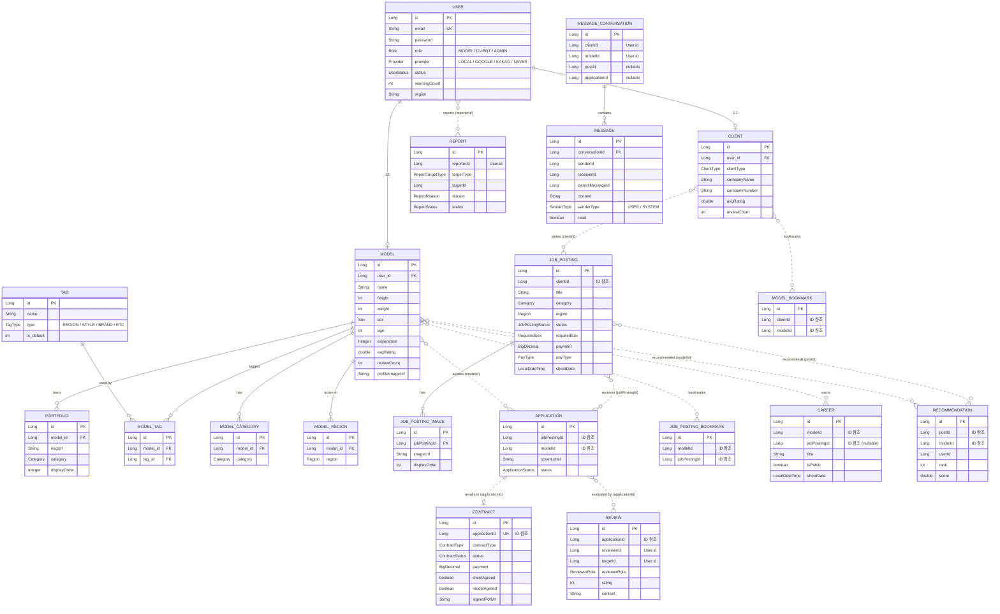

<div align="center">

# 
</g>
</svg>


**모델이 필요한, 모델이 되고 싶은 분들을 위한 매칭 플랫폼, MODLE**

광고·화보·행사 등 다양한 촬영에 필요한 모델과 이를 찾는 클라이언트를
AI 추천 기반으로 연결하고, 지원·계약·리뷰까지 한 곳에서 처리하는 매칭 서비스입니다.

[🔗 서비스 바로가기](https://modle-eta.vercel.app) · [📹 데모 영상](https://example.com)

</div>

---

## 📑 목차

1. [프로젝트 소개](#-프로젝트-소개)
2. [멤버 소개](#-멤버-소개)
3. [기술 스택](#-기술-스택)
4. [주요 기능](#-주요-기능)
5. [API 명세서](#-api-명세서)
6. [파일 구조](#-파일-구조)
7. [시스템 아키텍처](#-시스템-아키텍처)
8. [ERD](#-erd)
9. [실행 방법](#-실행-방법)

---

## 📌 프로젝트 소개

**Modle**은 모델 구인을 원하는 **클라이언트(Client)** 와 일감을 찾는 **모델(Model)** 을 매칭해주는 플랫폼입니다.

- **다양한 모델**을 매칭하고 찾을 수 있는 플랫폼입니다.
- **클라이언트**는 촬영 조건(카테고리·지역·성별·신체 조건·페이 등)을 담은 **공고**를 등록하고, 지원자를 관리합니다.
- **모델**은 자신의 **프로필·포트폴리오**를 등록하고 원하는 공고에 **지원**합니다.
- **AI 임베딩 기반 추천**으로 공고에 적합한 모델, 모델에게 적합한 공고를 추천합니다.
- 매칭이 성사되면 **쪽지**로 소통하고, **전자 계약서(PDF)** 작성·서명을 거쳐 촬영을 진행한 뒤 **상호 리뷰**를 남깁니다.
- **관리자**는 클라이언트 가입 승인, 신고 처리 등 플랫폼 운영을 담당합니다.

| 항목 | 내용 |
|------|------|
| 프로젝트명 | Modle |
| 팀명 | AIBE6 Project2 Team01(락(樂)&롤(Role)) |
| 개발 기간 | 2026.06.11 ~ 2026.06.24 |
| 한 줄 소개 | 모델이 필요한, 모델이 되고 싶은 분들을 위한 매칭 플랫폼 |

---

## 👥 멤버 소개

| **김락현** | **김영욱** | **신재희** | **임현호** | **김영욱** |
|---------|---------|---------|---------|---------|
| [@Rakhyunn](https://github.com/Rakhyunn) | [@wooki0123](https://github.com/wooki0123) | [@SHINJAEHEE-DEV](https://github.com/SHINJAEHEE-DEV) | [@predevho](https://github.com/predevho) | [@woo0218](https://github.com/woo0218) |

### 담당 기능

<details>
<summary><b>🧑‍💻 김락현 </b></summary>

- 인증/인가 도메인
- 신뢰 및 리뷰 도메인
- 지원 완료 API

</details>

<details>
<summary><b>🧑‍💻 김영욱 </b></summary>

- 공고 도메인
- 지원 보류 및 취소 API

</details>

<details>
<summary><b>🧑‍💻 신재희 </b></summary>

- 프로필 도메인
- 프론트

</details>

<details>
<summary><b>🧑‍💻 임현호 </b></summary>

- 계약 도메인
- 계약-쪽지 연동 API

</details>

<details>
<summary><b>🧑‍💻 최정우 </b></summary>

- 쪽지 도메인
- AI 추천 도메인

</details>

---

## 🛠 기술 스택

### Backend


### Frontend


### Database & Infra


### AI / 외부 연동
- **OpenAI Embeddings** — 공고/모델 텍스트 임베딩 (추천용 벡터 생성)
- **Groq API** — LLM 기반 처리
- **OAuth2** — Google · Kakao · Naver 소셜 로그인
- **Sendgrid** — 이메일 인증/알림 발송
- **OpenHTMLtoPDF** — 계약서 PDF 생성
- **Swagger (springdoc-openapi)** — API 문서 자동화

### 상세 버전

| 구분 | 기술 | 버전 |
|------|------|------|
| Language | Java | 21 |
| Framework | Spring Boot | 3.5.15 |
| Build | Gradle (Kotlin DSL) | - |
| DB | MySQL | 8.x |
| Cache/Session | Redis | 7.0 |
| Auth | JWT (jjwt) | 0.12.6 |
| Storage | Spring Cloud GCP Storage | 5.0.4 |
| API Docs | springdoc-openapi | 2.8.9 |
| PDF | openhtmltopdf | 1.0.10 |
| Frontend | Next.js | 16.2.9 |
| Frontend | React | 19.2.4 |
| Styling | Tailwind CSS | 4 |
| API Client | openapi-fetch / openapi-typescript | - |

---

## ✨ 주요 기능

### 👤 회원 / 인증 (`user`)
- 모델 / 클라이언트 / 관리자 역할(Role) 기반 회원가입 및 로그인
- 로컬 가입 + **OAuth2 소셜 로그인** (Google, Kakao, Naver)
- **JWT** Access / Refresh 토큰 인증, Redis 기반 토큰 관리
- 이메일 인증, 비밀번호 찾기
- 회원 상태 관리 (ACTIVE / PENDING / INCOMPLETE / REJECTED / SUSPENDED)

### 🧑‍🎤 프로필 / 포트폴리오 (`profile`)
- 모델 프로필 (신체 정보, 사이즈, 경력, 활동 가능 요일, 지역/카테고리/태그)
- 클라이언트 프로필 (업체 정보, 클라이언트 유형)
- 포트폴리오 이미지 업로드 (드래그 앤 드롭 순서 변경 — `@dnd-kit`)
- 모델 북마크 / 클라이언트 태그

### 📋 공고 (`jobposting`)
- 클라이언트의 모델 구인 공고 등록 / 수정 / 마감
- 카테고리·지역·성별·연령·신체조건·페이 타입(현금/서비스) 등 상세 조건
- 공고 이미지 첨부, 공고 북마크
- **AI 추천** — 임베딩 기반 모델↔공고 추천 (`ModelEmbedding`, `PostEmbedding`, `Recommendation`)

### 📨 지원 (`application`)
- 모델의 공고 지원 / 지원 취소 (자기소개 포함)
- 지원 상태 흐름 관리: 지원 → 연락 → 계약서 발송 → 촬영 → 완료 / 보류 / 취소

### 💬 쪽지 (`message`)
- 클라이언트 ↔ 모델 간 1:1 쪽지(대화) 기능
- 읽음 처리, 시스템 메시지(SenderType), 카드형 배너 메시지

### 📝 계약 (`contract`)
- 전자 계약서 작성 (촬영 일정, 장소, 페이, 사용 범위 등)
- **계약서 PDF 생성** 및 양 당사자 동의/서명, IP·시각 기록
- 계약 상태 흐름: DRAFT → NOTIFIED → VIEWED → CONFIRMED / REJECTED
- 계약서 템플릿(`ContractTemplate`)

### ⭐ 리뷰 / 신고 (`review`)
- 촬영 완료 후 클라이언트↔모델 **상호 리뷰** (지원 건당 1회)
- 평점 집계 (평균 평점, 리뷰 수)
- 신고(Report) 기능 및 검증

### 🛡 관리자 (`admin`)
- 클라이언트 가입 승인 / 거절
- 신고 처리, 회원 경고·정지 관리
- 거절된 회원 자동 정리 스케줄러

---

## 📖 API 명세서

전체 API는 **Swagger UI**로 자동 문서화되어 있습니다. 백엔드 실행 후 아래 주소에서 요청/응답 스키마와 함께 직접 테스트할 수 있습니다.

> 🔗 **Swagger UI** : `http://modle-production.up.railway.app/swagger-ui/index.html`

- 모든 엔드포인트는 `/api/v1` 하위에 위치합니다.
- 인증이 필요한 API는 **JWT 토큰(쿠키)** 기반으로 동작합니다.
- 아래는 주요 엔드포인트 요약이며, 상세 스펙은 Swagger를 참고하세요.

<details>
<summary><b>🔐 인증 / 회원 — <code>/api/v1/auth</code></b></summary>

| Method | Endpoint | 설명 |
|--------|----------|------|
| `POST` | `/signup/model` | 모델 회원가입 |
| `POST` | `/signup/client` | 의뢰인 회원가입 (관리자 승인 필요) |
| `POST` | `/signup/additional` | 소셜 가입 추가 정보 입력 |
| `POST` | `/email/verify/send` | 이메일 인증 코드 발송 |
| `POST` | `/email/verify/confirm` | 이메일 인증 코드 확인 |
| `POST` | `/login` | 로그인 (토큰 쿠키 발급) |
| `POST` | `/logout` | 로그아웃 |
| `POST` | `/reissue` | 액세스/리프레시 토큰 재발급 |
| `GET` | `/me` | 내 정보 조회 |
| `POST` | `/password/reset/send` | 비밀번호 재설정 코드 발송 |
| `POST` | `/password/reset/confirm` | 비밀번호 재설정 코드 확인 |
| `POST` | `/password/reset` | 비밀번호 재설정 |

</details>

<details>
<summary><b>🧑‍🎤 모델 프로필 — <code>/api/v1/models</code></b></summary>

| Method | Endpoint | 설명 |
|--------|----------|------|
| `GET` | `/` | 모델 다건 조회 및 필터링 |
| `GET` | `/{id}` | 모델 단건 조회 |
| `GET` | `/my` | 내 프로필 조회 |
| `PUT` | `/my` | 내 프로필 수정 |
| `DELETE` | `/{id}` | 모델 삭제 |

</details>

<details>
<summary><b>🏢 의뢰인 프로필 — <code>/api/v1/clients</code></b></summary>

| Method | Endpoint | 설명 |
|--------|----------|------|
| `GET` | `/` | 의뢰인 다건 조회 |
| `GET` | `/{id}` | 의뢰인 단건 조회 |
| `GET` | `/my` | 내 프로필 조회 |
| `GET` | `/{id}/job-postings` | 의뢰인 공개 공고 목록 (상태 필터) |
| `PUT` | `/my` | 내 프로필 수정 |
| `DELETE` | `/{id}` | 의뢰인 삭제 |

</details>

<details>
<summary><b>🖼 포트폴리오 / 이미지 / 경력</b></summary>

**포트폴리오** — `/api/v1/portfolios`
| Method | Endpoint | 설명 |
|--------|----------|------|
| `POST` | `/` | 포트폴리오 이미지 업로드 (다중, MODEL) |
| `PUT` | `/{id}` | 포트폴리오 정보 수정 |
| `PUT` | `/reorder` | 포트폴리오 노출 순서 변경 |
| `DELETE` | `/{id}` | 포트폴리오 삭제 |

**이미지** — `/api/v1/images`
| Method | Endpoint | 설명 |
|--------|----------|------|
| `POST` | `/upload` | 이미지 GCS 업로드 후 URL 반환 |

**경력** — `/api/v1`
| Method | Endpoint | 설명 |
|--------|----------|------|
| `GET` | `/careers/my` | 내 경력 조회 (MODEL) |
| `GET` | `/models/{modelId}/careers` | 모델 공개 경력 조회 |
| `PATCH` | `/careers/{careerId}/public` | 경력 공개 여부 변경 (MODEL) |

</details>

<details>
<summary><b>📋 공고 — <code>/api/v1/jobs</code></b></summary>

| Method | Endpoint | 설명 |
|--------|----------|------|
| `POST` | `/templates/generate` | AI 공고 본문 생성 (CLIENT) |
| `POST` | `/` | 공고 등록 + AI 모델 추천 트리거 (CLIENT) |
| `GET` | `/` | 공고 목록 조회 (지역·카테고리·상태 필터) |
| `GET` | `/{id}` | 공고 상세 조회 (역할별 맞춤) |
| `PATCH` | `/{id}` | 공고 수정 (CLIENT) |
| `DELETE` | `/{id}` | 공고 삭제 (CLIENT) |
| `PATCH` | `/{id}/status` | 공고 상태 변경 (CLIENT) |
| `GET` | `/my` | 내가 작성한 전체 공고 목록 (CLIENT) |
| `GET` | `/mine/recruiting` | 내 모집 중 공고 목록 (CLIENT) |
| `GET` | `/{id}/recommendations` | AI 추천 모델 목록 (CLIENT) |
| `POST` | `/{id}/recommendations/unlock` | 추천 모델 잠금 해제 (CLIENT) |

</details>

<details>
<summary><b>📨 지원 — <code>/api/v1</code></b></summary>

| Method | Endpoint | 설명 |
|--------|----------|------|
| `POST` | `/jobs/{id}/apply` | 공고 지원 (MODEL) |
| `GET` | `/jobs/{id}/apply-status` | 지원 여부 확인 (MODEL) |
| `GET` | `/jobs/{id}/applicants` | 지원자 목록 조회 (CLIENT) |
| `GET` | `/applications/my` | 내 지원 목록 조회 (MODEL) |
| `PATCH` | `/applications/{id}/cancel` | 지원 취소 (MODEL) |
| `POST` | `/applications/{id}/contact` | 지원자 컨택 (CLIENT) |
| `GET` | `/applications/{id}/contacts` | 컨택 이력 조회 |
| `GET` | `/applications/{id}/contract-status` | 계약 진행 상태 조회 |
| `GET` | `/applications/{id}/contract-draft` | 계약 임시저장 조회 (CLIENT) |
| `PATCH` | `/applications/{id}/hold` | 촬영 보류 (CLIENT) |
| `PATCH` | `/applications/{id}/cancel-shooting` | 촬영 취소 (CLIENT) |
| `PATCH` | `/applications/{id}/resume` | 촬영 재개 (CLIENT) |
| `PATCH` | `/applications/{id}/complete` | 촬영 완료 처리 (CLIENT) |
| `POST` | `/applications/{id}/re-recruit` | 재모집 전환 (CLIENT) |

</details>

<details>
<summary><b>📝 계약 — <code>/api/v1/contracts</code></b></summary>

| Method | Endpoint | 설명 |
|--------|----------|------|
| `POST` | `/` | 계약서 임시 저장 (DRAFT 생성) |
| `GET` | `/` | 상태별 계약 내역 조회 (CLIENT·MODEL) |
| `GET` | `/templates` | 계약서 템플릿 목록 조회 (CLIENT) |
| `POST` | `/pdf` | 계약서 PDF 생성 (CLIENT) |
| `POST` | `/{id}/notify` | 계약서 모델에게 발송 (CLIENT) |
| `GET` | `/{id}` | 계약서 열람 (MODEL) |
| `PATCH` | `/{id}/agree` | 계약서 동의 (양측 동의 시 자동 확정) |
| `PATCH` | `/{id}/reject` | 계약서 거부 (MODEL) |

</details>

<details>
<summary><b>💬 쪽지 — <code>/api/v1/messages</code></b></summary>

| Method | Endpoint | 설명 |
|--------|----------|------|
| `POST` | `/conversations` | 대화방 생성 |
| `GET` | `/conversations` | 내 대화 목록 조회 |
| `GET` | `/conversations/{conversationId}/messages` | 대화방 메시지 조회 (페이징) |
| `POST` | `/` | 쪽지 전송 |
| `PATCH` | `/read` | 대화방 읽음 처리 |
| `DELETE` | `/conversations/{conversationId}` | 대화방 삭제 |

</details>

<details>
<summary><b>⭐ 북마크 / 리뷰 / 신고</b></summary>

**북마크** — `/api/v1/bookmarks`
| Method | Endpoint | 설명 |
|--------|----------|------|
| `POST` | `/jobs/{jobPostingId}` | 공고 북마크 추가 (MODEL) |
| `DELETE` | `/jobs/{jobPostingId}` | 공고 북마크 삭제 (MODEL) |
| `GET` | `/jobs` | 내 공고 북마크 목록 (MODEL) |
| `POST` | `/models/{modelId}` | 모델 북마크 추가 (CLIENT) |
| `DELETE` | `/models/{modelId}` | 모델 북마크 삭제 (CLIENT) |
| `GET` | `/models` | 내 모델 북마크 목록 (CLIENT) |

**리뷰** — `/api/v1/reviews`
| Method | Endpoint | 설명 |
|--------|----------|------|
| `POST` | `/` | 리뷰 작성 (의뢰인↔모델) |
| `GET` | `/users/{userId}/reviews` | 특정 유저가 받은 리뷰 목록 |

**신고** — `/api/v1`
| Method | Endpoint | 설명 |
|--------|----------|------|
| `POST` | `/reports` | 신고 접수 |
| `GET` | `/admin/reports` | 신고 목록 조회 (ADMIN) |
| `PATCH` | `/admin/reports/{reportId}` | 신고 처리 (ADMIN) |

</details>

<details>
<summary><b>🛡 관리자 — <code>/api/v1/admin</code></b></summary>

| Method | Endpoint | 설명 |
|--------|----------|------|
| `GET` | `/clients/pending` | 승인 대기 의뢰인 목록 조회 |
| `PATCH` | `/clients/{userId}/approve` | 의뢰인 가입 승인 |
| `PATCH` | `/clients/{userId}/reject` | 의뢰인 가입 반려 |
| `GET` | `/users/warnings` | 경고 누적 유저 목록 조회 |
| `GET` | `/reports/no-show` | 노쇼 신고 목록 조회 |
| `PATCH` | `/users/{userId}/suspend` | 계정 정지 |

</details>

---

## 📂 파일 구조

```
AIBE6_Project2_Team01/
├── modle_backend/                # Spring Boot 백엔드
│   ├── src/main/java/com/modle/
│   │   ├── ModleBackendApplication.java
│   │   ├── domain/               # 도메인별 패키지 (controller/service/repository/entity/dto)
│   │   │   ├── admin/            # 관리자
│   │   │   ├── application/      # 지원
│   │   │   ├── bookmark/         # 북마크
│   │   │   ├── contract/         # 계약 (+ pdf, template, init)
│   │   │   ├── jobposting/       # 공고 (+ AI 추천 embedding)
│   │   │   ├── message/          # 쪽지
│   │   │   ├── profile/          # 프로필/포트폴리오/태그
│   │   │   ├── review/           # 리뷰/신고
│   │   │   └── user/             # 회원/인증
│   │   ├── global/               # 공통 모듈
│   │   │   ├── auth/             # 인증 (JWT 등)
│   │   │   ├── config/           # Security, Redis, Async, OpenApi 설정
│   │   │   ├── entity/           # BaseEntity
│   │   │   ├── exception/        # 예외 처리
│   │   │   ├── gcs/              # GCS 파일 업로드
│   │   │   ├── response/         # 공통 응답
│   │   │   ├── rq/               # 요청 컨텍스트
│   │   │   ├── scheduler/        # 스케줄러
│   │   │   └── util/
│   │   └── infra/                # 외부 연동
│   │       ├── ai/               # OpenAI Embedding, Groq API
│   │       └── mail/             # 메일 발송
│   ├── src/main/resources/
│   │   ├── application.yml       # 공통 설정
│   │   ├── application-dev.yml
│   │   ├── application-test.yml
│   │   ├── fonts/                # PDF용 폰트
│   │   └── templates/            # 계약서 템플릿 등
│   ├── docker-compose.yml        # Redis
│   └── build.gradle.kts
│
├── modle_frontend/               # Next.js 프론트엔드
│   ├── src/
│   │   ├── app/                  # App Router (페이지)
│   │   │   ├── (auth)/           # 로그인/회원가입/비밀번호찾기
│   │   │   ├── admin/            # 관리자
│   │   │   ├── application/      # 지원
│   │   │   ├── clients/          # 클라이언트
│   │   │   ├── contracts/        # 계약
│   │   │   ├── jobs/             # 공고
│   │   │   ├── messages/         # 쪽지
│   │   │   ├── models/           # 모델
│   │   │   └── my/               # 마이페이지
│   │   ├── components/           # UI 컴포넌트 (도메인별)
│   │   ├── hooks/                # 커스텀 훅
│   │   ├── lib/                  # api 클라이언트, auth, constants
│   │   └── types/
│   ├── public/
│   └── package.json
│
├── docs/                         # 설계 문서
└── README.md
```

---

## 🏗 시스템 아키텍처



---

## 🗄 ERD



---

## 🚀 실행 방법

### 사전 요구사항
- JDK 21
- Node.js 18+ (Next.js 16)
- MySQL 8.x (`modle` 데이터베이스 생성)
- Docker (Redis 실행용) 또는 로컬 Redis

### 1. 저장소 클론
```bash
git clone https://github.com/prgrms-aibe-devcourse/AIBE6_Project2_Team01.git
cd AIBE6_Project2_Team01
```

### 2. Backend 실행

**(1) Redis 실행 (Docker)**
```bash
cd modle_backend
docker compose up -d
```

**(2) 환경 변수 설정**

`modle_backend/.env` 파일을 생성하고 아래 값을 채워주세요.
```env
DB_PASSWORD=your_mysql_password
JWT_SECRET=your_jwt_secret

REDIS_HOST=localhost
REDIS_PORT=6379

SPRING_PROFILES_ACTIVE=dev

# Mail
SENDGRID_API_KEY=...
MAIL_FROM=your_mail

# GCP Storage
GCP_PROJECT_ID=your_gcp_project_id
GCS_BUCKET_NAME=your_bucket_name
GCS_CREDENTIALS_PATH=classpath:gcs-key.json

# OAuth2
GOOGLE_CLIENT_ID=...
GOOGLE_CLIENT_SECRET=...
KAKAO_CLIENT_ID=...
KAKAO_CLIENT_SECRET=...
NAVER_CLIENT_ID=...
NAVER_CLIENT_SECRET=...

# AI
GROQ_API_KEY=...
OPENAI_API_KEY=...
OPENAI_EMBEDDING_MODEL=text-embedding-3-small

# (선택) 프론트엔드 base URL
FRONTEND_BASE_URL=http://localhost:3000
```
> GCS 서비스 계정 키 파일(`gcs-key.json`)도 함께 준비해야 합니다.

**(3) 서버 실행**
```bash
./gradlew bootRun
# Windows
gradlew.bat bootRun
```
- 백엔드: `http://localhost:8080`
- Swagger UI: `http://localhost:8080/swagger-ui/index.html`

### 3. Frontend 실행
```bash
cd modle_frontend
npm install
npm run dev
```
- 프론트엔드: `http://localhost:3000`

**(선택) API 타입 자동 생성** — 백엔드 실행 중일 때:
```bash
npm run gen:api
```

---

<div align="center">

**Modle**

</div>
